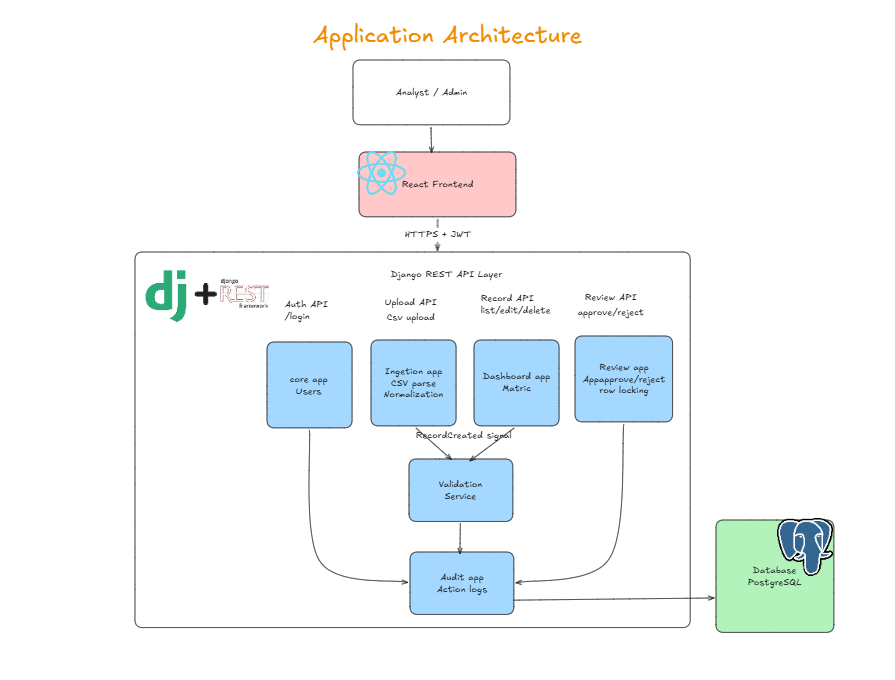
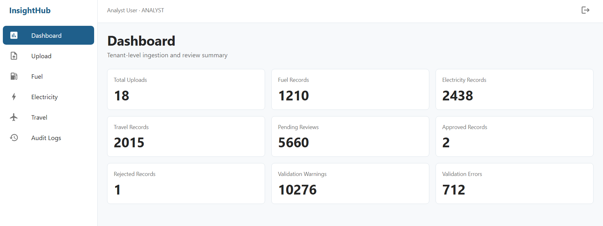
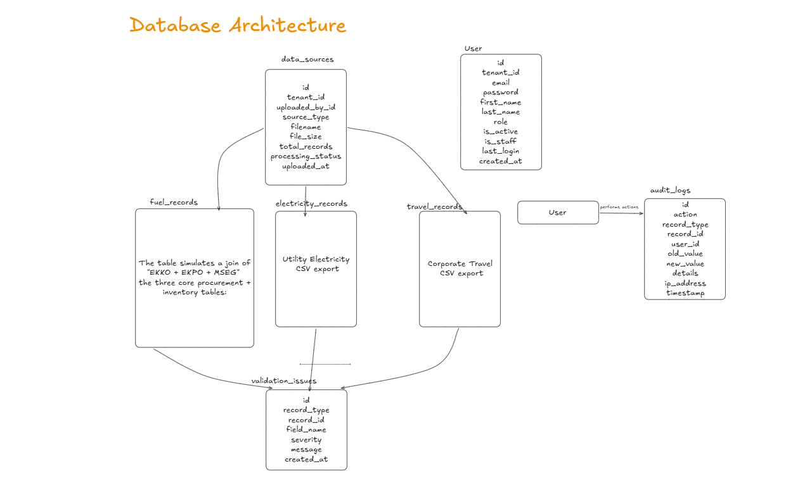
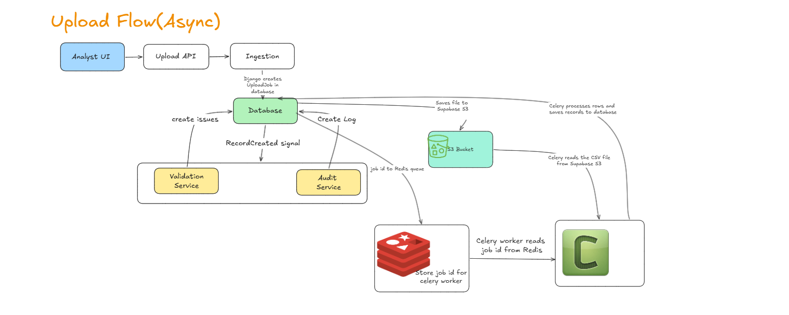
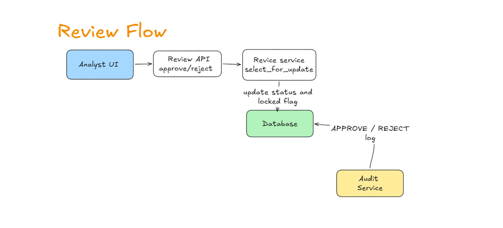
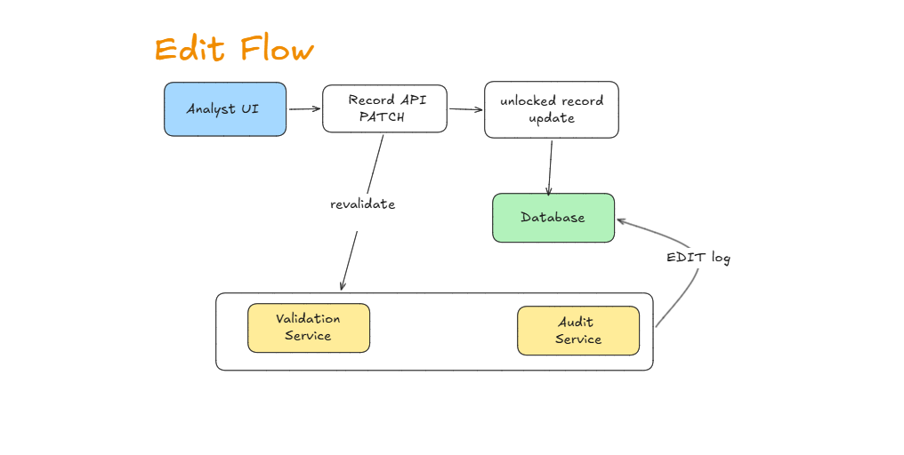

# InsightHub

ESG data review assignment built with Django REST Framework and React.

The app lets an analyst upload CSV files, validate records, review/approve data, view dashboard metrics, and inspect audit logs.

## Overview





## Database Architecture



## Main Flows

### Upload Flow



### Review Flow



### Edit Flow



## Tech Stack

- Backend: Django, Django REST Framework, Simple JWT
- Frontend: React, Vite, Material UI, React Query
- Database: PostgreSQL
- File storage: S3-compatible storage
- Background jobs: Celery + Redis in production

## Features

- JWT login with protected frontend routes
- Tenant-scoped data access
- CSV upload for SAP fuel, utility electricity, and travel data
- Async upload jobs with status tracking and retry
- Source file lineage with original CSV row stored in `source_payload`
- Separate record pages for fuel, electricity, and travel
- Record search, filters, pagination, CSV export, edit, and delete
- Validation issues with `INFO`, `WARNING`, and `ERROR` severity levels
- Source-specific validation for SAP fuel, utility bills, and travel expenses
- Approve/reject workflow with approved records locked
- Dashboard summary and metric drilldowns
- Audit log for create, edit, approve, reject, and delete actions
- PostgreSQL/Supabase support with SQLite local fallback
- S3-compatible file storage and Celery + Redis background processing in production

## Project Structure

| Path | Purpose |
| --- | --- |
| `apps/core/` | Tenant, custom user model, permissions, cache helpers, and demo seed command |
| `apps/ingestion/` | CSV uploads, upload jobs, parsing, record models, serializers, and record APIs |
| `apps/validation_service/` | Validation rules and validation issue storage |
| `apps/review/` | Approve/reject workflow and record locking logic |
| `apps/audit/` | Audit log model, serializers, API, and signal receivers |
| `apps/dashboard/` | Dashboard summary and drilldown APIs |
| `InsightHub/` | Django settings, root URLs, WSGI, and Celery app setup |
| `frontend/src/api/` | Frontend API client and auth helpers |
| `frontend/src/components/` | Shared React layout, page header, and record table components |
| `frontend/src/pages/` | Dashboard, upload, records, audit, and login pages |
| `frontend/src/theme/` | Material UI theme configuration |
| `samples/` | Sample SAP fuel, utility, and travel CSV files |
| `MODEL.md` | Data model and workflow notes |
| `DECISIONS.md` | Architecture and source decision notes |
| `SOURCES.md` | Source assumptions and research notes |
| `TRADEOFFS.md` | Known tradeoffs and limitations |

## Setup

### Backend

```bash
python -m venv .venv
.venv\Scripts\activate
pip install -r requirements.txt
$env:DEBUG="True"
$env:USE_LOCAL_MEDIA_STORAGE="True"
python manage.py migrate
python manage.py seed_demo
python manage.py runserver
```

### Frontend

```bash
cd frontend
npm install
npm run dev
```

## Deployment

### Railway Backend

Deploy the repository root to Railway. Railway will use the root `Dockerfile`.

Create two Railway services from the same repo:

| Service | Start command |
| --- | --- |
| Backend web | Use the Dockerfile default command |
| Celery worker | `celery -A InsightHub worker --loglevel=info` |

The Dockerfile default command runs migrations, collects static files, and starts Gunicorn on Railway's `$PORT`.

Add Railway services:

- PostgreSQL
- Redis

Set backend environment variables:

```env
DEBUG=False
SECRET_KEY=replace-with-a-strong-secret
ALLOWED_HOSTS=your-backend.up.railway.app
CORS_ALLOWED_ORIGINS=https://your-frontend.vercel.app
CSRF_TRUSTED_ORIGINS=https://your-frontend.vercel.app
DATABASE_URL=${{Postgres.DATABASE_URL}}
REDIS_URL=${{Redis.REDIS_URL}}
CELERY_BROKER_URL=${{Redis.REDIS_URL}}
CELERY_RESULT_BACKEND=${{Redis.REDIS_URL}}
USE_S3_STORAGE=True
SUPABASE_S3_ACCESS_KEY_ID=...
SUPABASE_S3_SECRET_ACCESS_KEY=...
SUPABASE_S3_BUCKET=...
SUPABASE_S3_ENDPOINT_URL=...
SUPABASE_S3_REGION=us-east-1
```

S3-compatible storage is needed because the web and Celery containers both need access to uploaded CSV files.

After the first deploy, run:

```bash
python manage.py seed_demo
```

### Vercel Frontend

Deploy the `frontend/` directory as the Vercel project.

Use these settings:

```text
Framework Preset: Vite
Root Directory: frontend
Build Command: npm run build
Output Directory: dist
```

Set frontend environment variables:

```env
VITE_API_URL=https://your-backend.up.railway.app/api
```

The frontend includes `frontend/vercel.json` so direct routes like `/upload`, `/audit`, and `/fuel` load correctly.

## Sample CSVs

Example files are available in `samples/`:

- `sap_fuel.csv`
- `utility.csv`
- `travel.csv`

## API Overview

| Area | Method | Endpoint | Description |
| --- | --- | --- | --- |
| Auth | POST | `/api/auth/register` | Create an analyst user and issue access and refresh tokens |
| Auth | POST | `/api/auth/login` | Issue access and refresh tokens for a user |
| Auth | POST | `/api/auth/refresh` | Refresh an expired access token |
| Upload | POST | `/api/upload/sap` | Upload SAP fuel CSV data |
| Upload | POST | `/api/upload/utility` | Upload utility electricity CSV data |
| Upload | POST | `/api/upload/travel` | Upload travel expense CSV data |
| Upload Jobs | GET | `/api/upload/jobs` | List async upload jobs |
| Upload Jobs | GET | `/api/upload/jobs/<id>` | Retrieve upload job status and errors |
| Upload Jobs | POST | `/api/upload/jobs/<id>/retry` | Retry a failed upload job |
| Records | GET | `/api/fuel` | List fuel records with filters and pagination |
| Records | PATCH | `/api/fuel/<id>` | Edit a fuel record and trigger revalidation |
| Records | DELETE | `/api/fuel/<id>` | Delete a fuel record |
| Records | GET | `/api/electricity` | List electricity records with filters and pagination |
| Records | PATCH | `/api/electricity/<id>` | Edit an electricity record and trigger revalidation |
| Records | DELETE | `/api/electricity/<id>` | Delete an electricity record |
| Records | GET | `/api/travel` | List travel records with filters and pagination |
| Records | PATCH | `/api/travel/<id>` | Edit a travel record and trigger revalidation |
| Records | DELETE | `/api/travel/<id>` | Delete a travel record |
| Review | POST | `/api/review/approve` | Approve a validated record |
| Review | POST | `/api/review/reject` | Reject a record that needs correction |
| Audit | GET | `/api/audit` | List audit log entries |
| Dashboard | GET | `/api/dashboard` | Retrieve dashboard summary metrics |
| Dashboard | GET | `/api/dashboard/drilldown` | Retrieve metric-level drilldown records |

Upload requests use multipart form data with a `file` field.

Review request:

```json
{
  "record_type": "FUEL",
  "record_id": 1
}
```

## Supporting Docs

- `MODEL.md`
- `DECISIONS.md`
- `TRADEOFFS.md`
- `SOURCES.md`
